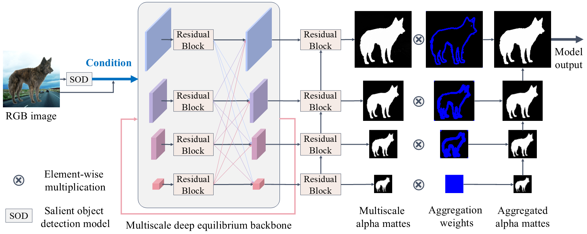

# DEQ-Matt: Image Matting Based on Deep Equilibrium Models

Official implementation of the ICANN 2024 paper [Image Matting Based on Deep Equilibrium Models](https://link.springer.com/chapter/10.1007/978-3-031-72335-3_26). 

<p align="middle">
    
</p>

## Installation
Plese download the pre-trained weights from [MDEQ](https://github.com/locuslab/mdeq) and [InSPyReNet](https://github.com/plemeri/InSPyReNet) and put them in `./pretrained/`.

## Evaluation
### Data Preparation
Please organize the datasets as follows.

    ../                         # parent directory
    ├── ./                      # current (project) directory
    ├── AMD/                    # the dataset
    │   ├── train/
    │   │   ├── fg/
    │   │   └── alpha/
    │   └── test/           
    │       ├── merged/
    │       └── alpha_copy/
    ├── ...

### Train & Test
    
```sh
python main.py --dataset [dataset_name]
```

## Acknowledgement
Thanks to the code base from [GCA-Matting](https://github.com/Yaoyi-Li/GCA-Matting), [MODNet](https://github.com/ZHKKKe/MODNet), [MGMatting](https://github.com/yucornetto/MGMatting), [MatteFormer](https://github.com/webtoon/matteformer), [MDEQ](https://github.com/locuslab/mdeq), [InSPyReNet](https://github.com/plemeri/InSPyReNet)

## Citation
If you find our code or paper helps, please consider citing:
```
@InProceedings{10.1007/978-3-031-72335-3_26,
    author="Liu, Xinshuang
    and Zhao, Yue",
    editor="Wand, Michael
    and Malinovsk{\'a}, Krist{\'i}na
    and Schmidhuber, J{\"u}rgen
    and Tetko, Igor V.",
    title="Image Matting Based on Deep Equilibrium Models",
    booktitle="Artificial Neural Networks and Machine Learning -- ICANN 2024",
    year="2024",
    publisher="Springer Nature Switzerland",
    address="Cham",
    pages="379--391",
    isbn="978-3-031-72335-3"
}
```
